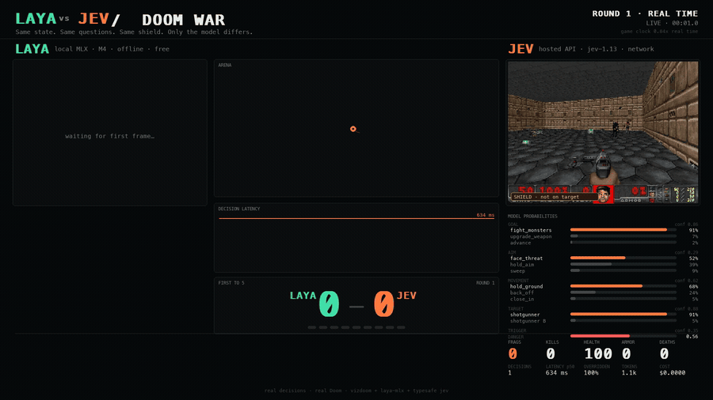
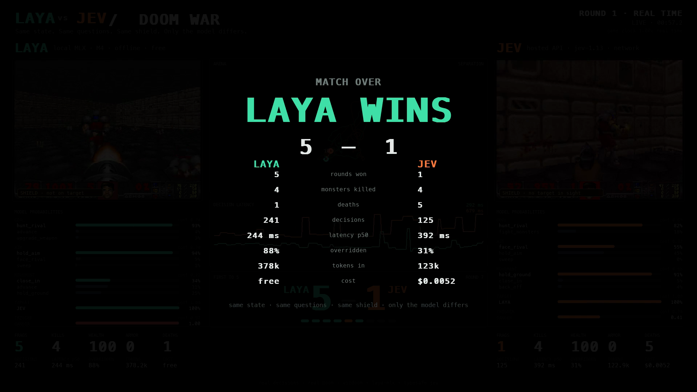

<div align="center">

# ⚔️ DOOM WAR — Laya vs Jev

**Two System One models fight a real Doom deathmatch.**
Same state. Same questions. Same shield. Only the model differs.

[](https://www.python.org/)
[](https://developer.apple.com/metal/)
[](https://github.com/ml-explore/mlx)
[](https://github.com/Farama-Foundation/ViZDoom)
[](https://typesafe.ai)
[](https://huggingface.co/aac6fef/laya-multilingual-mlx)
[](LICENSE)
[](#the-questions)



**[▶ Watch the full 26s run (1080p)](media/doom-war.mp4)**

</div>

---

## What this is

Two models of the same *class* — **System One models**, which return typed
decisions and calibrated probabilities instead of text — driving two players in
one live Doom deathmatch against each other.

| | **Laya** | **Jev** |
|---|---|---|
| what | open weights, 322M params | TypeSafe's hosted `jev-1.13` |
| where | local, on an Apple M4 via MLX | over the network |
| cost | free, fully offline | $0.042 / MTok input |
| output tokens | 0 | 0 |

Neither model ever sees a pixel. Deterministic code reads the game state,
compresses it to short prose, and asks each model the **same** typed questions.
The model picks a macro; code turns that into Doom inputs.

```
ViZDoom state ──► observation ──► typed questions ──► model ──► macro ──► buttons
                    (code)          (identical)                  (code)
```

That split is deliberate, and it is what TypeSafe's own docs recommend:
*offload computation, filter data, ask one well-scoped thing at a time.*

---

## The result

<div align="center"></div>

```
                        LAYA         JEV
  rounds won               5           1
  deaths                   1           5
  decisions              264         136
  latency p50       244.1 ms    399.8 ms
  overridden           88.3%       30.7%
  tokens in           414,426     132,875
  cost                  free   $0.005581
  ───────────────────────────────────────
  WINNER: LAYA   5 - 1
```

**Laya won on volume.** Roughly twice the decisions in the same wall clock, so
it re-aimed and re-fired far more often. **Jev needed a third of the
corrections** — its individual calls were clearly better — but at ~400 ms each
it was acting on staler information every time it pulled the trigger.

Run `--mode equal` and that volume advantage disappears entirely. Full
telemetry in [`results/match.json`](results/match.json).

---

## How it works

### The arena

Generated at runtime as a **UDMF PWAD** by [`doomwar/mapgen.py`](doomwar/mapgen.py)
— no map editor, no node builder. ZDoom (which ViZDoom is built on) compiles
BSP nodes at load time, so the generator only has to emit `TEXTMAP`.

- An empty **800×800** square box. Four linedefs. No cover.
- Spawns in opposite corners, **877 units apart, in line of sight from tic one**.
- Two monsters in each of the other two corners — pressure without standing
  between the fighters.
- Mirrored kit per side, contested chaingun in the middle.

### The questions

Up to seven per decision, identical for both models, built from what actually
exists in the world so neither can pick something that isn't there:

| id | type | asks |
|---|---|---|
| `goal` | choice | hunt the rival · fight monsters · heal · restock · upgrade · advance |
| `target` | choice | which enemy is most dangerous |
| `turn` | choice | face the rival · face the threat · hold aim · sweep |
| `movement` | choice | close in · hold · back off · strafe · advance |
| `trigger` | choice | hold the trigger down, or not |
| `dodge` | choice | carry on · break left · break right |
| `danger` | noul | about to take serious damage? |

The state also carries **spatial senses** sampled from the depth buffer
(`space: {ahead: wide open, left: tight, right: blocked}`) and an always-on fix
on the rival, flagged `LINED UP IN THE SIGHTS` when it sits inside a 25° cone
and in range.

### The shield

A deterministic layer between the answer and the engine, modelled on the cycle
shield in `laya-mlx`'s Snake demo. It blocks a shot with no ammo, no target, or
a target outside a 30° cone; redirects a move that would walk into a wall; and
breaks a fighter out of geometry it has been grinding for 12 decisions.

**Every correction is counted and shown live as `OVERRIDDEN %`** — how often
deterministic code had to save the model from itself. It is one of the more
revealing numbers in the run. `--no-shield` removes it.

### Match structure

One continuous deathmatch. **Every frag is a round; first to five wins.** No
restarts, no dead air. If nobody scores for 10 s the goal list narrows to
hunt-or-fight; at 18 s the objective is fixed outright. Both fighters flip at
the same instant, so a stalled fight always resolves.

### Timing modes

| | `--mode realtime` *(default)* | `--mode equal` |
|---|---|---|
| engine clock | pinned to Doom's 35 tics/s | advances only when both have decided |
| decisions | each model gets as many as it can | identical count for both |
| measures | judgment **×** speed | judgment alone |
| handicap | a slow model acts on stale state | none |

Both keep the two engines in lockstep on game tics, so neither fighter ever
gets free frames.

---

## Measured on this machine

Apple M4 · 8 GPU cores · 16 GiB · macOS 15.7.3. Identical state, identical
5-question payload:

| | Laya (local) | Jev (hosted) |
|---|---:|---:|
| latency p50 | **144 ms** | 610 ms |
| latency p95 | **145 ms** | 664 ms |
| cost / 1000 decisions | **free** | $0.039 |
| scaling | +28 ms per question | +19 ms per **nine** questions |

Two caveats that matter:

1. **Jev's latency here is dominated by network round trip**, not by the model.
   Even a single question costs ~395 ms from this location. TypeSafe documents
   70–500 ms end to end; this sits at the top of that band. Closer to their
   region it would be lower.
2. **Jev's answers were better.** With nothing in sight it said `hold_fire` at
   confidence 1.00 and `danger` 0.28. Laya said `fire` at 0.78 and `danger`
   0.94 — both wrong. Laya is a 322M open-weight model answering a question
   nobody trained it for. That gap is exactly what `OVERRIDDEN %` measures.

Jev is also nearly flat in question count while Laya is linear, so Jev would
overtake Laya on wall clock somewhere past ~15 questions per decision.

---

## Reproduce it

**Requirements:** Apple Silicon Mac, macOS 14+, Python 3.11 or 3.12,
[uv](https://github.com/astral-sh/uv), and `ffmpeg` if you want to render video.

```bash
git clone https://github.com/rythmn1111/doom-war.git
cd doom-war

uv venv --python 3.12
uv pip install -e '.[laya,render]'
```

**Get the Laya weights** (~660 MB, open, no account needed):

```bash
uv run hf download aac6fef/laya-multilingual-mlx \
  --local-dir models/laya-multilingual-mlx
```

**Set your Jev key** — grab one at [console.typesafe.ai/keys](https://console.typesafe.ai/keys):

```bash
export TYPESAFE_API_KEY="your-key-here"
```

> A `jev.txt` file in the repo root also works and is gitignored — but the
> environment variable is the safer habit.

**Fight:**

```bash
uv run doom-war --rounds 5 --save-frames frames --record telemetry.jsonl
```

The arena WAD is generated on first run. A 1920×1080 dashboard opens, scaled to
fit your display; frames are always captured at true 1080p regardless of screen
size. Press `Q` or `Esc` to stop early.

**Render the video:**

```bash
./render.sh frames out/doom-war.mp4
```

### Useful flags

| flag | default | does |
|---|---|---|
| `--rounds N` | `5` | frags needed to win the match |
| `--mode equal` | `realtime` | give both fighters the same decision count |
| `--no-shield` | off | execute raw model calls, no corrections |
| `--seconds N` | `240` | hard cap on match length |
| `--seed N` | `7` | arena and motor seed |
| `--model PATH` | bundled | a different Laya checkpoint |
| `--save-frames DIR` | off | true 1080p PNGs for a clean render |
| `--fps N` | `30` | frame capture rate |

---

## What this does and does not show

It **does** show two typed-decision models driving a real-time game loop from
identical structured state, with real probabilities, real measured latency,
real cost, and every deterministic override counted on screen.

It **does not** show either model reasoning about Doom from raw pixels. A
deterministic planner does the geometry, visibility and pathing and hands over
short descriptions; the models rank options. Neither was trained on Doom.
Nothing here is a claim about either model's general capability, and the
latency comparison measures *this Mac on this network*, not a datacentre.

No frames are simulated, smoothed, or replayed. `telemetry.jsonl` records every
decision made; `results/match.json` is the match summary.

<details>
<summary><b>Bugs worth knowing about, if you build something like this</b></summary>

Four things silently broke this build, in rough order of how long they cost:

1. **`TURN_LEFT_RIGHT_DELTA` is positive-is-right**, while a bearing computed
   with `atan2` is positive-is-left. Without the sign flip every aim command
   turns *away* from the target. A dedicated aim bot got on target 6 tics out
   of 700. One character fixed it and the fire rate tripled.
2. **`sv_noautoaim 1` with no pitch control** means no hitscan shot can ever
   land. Doom's vertical autoaim is doing real work; if your motor never
   touches `LOOK_UP_DOWN`, leave autoaim on.
3. **Applying a turn delta every tic** while the observation only refreshes
   every N tics overshoots by N×. Give a decision a turn *budget* and spend it
   down across the tics that follow.
4. **`label.object_id` ↔ `object.id`** is how you match the visible-actor list
   to world objects. Matching on rounded coordinates silently fails. And the
   label buffer misses actors that are very close or partly off-frame — use
   geometry as the reliable signal.

Also: `get_game_variable()` does not refresh until you call `get_state()`, and
`KILLCOUNT` is a shared level counter in a netgame, not per player.

</details>

---

## Project layout

```
doomwar/mapgen.py       generates the arena as a UDMF PWAD
doomwar/observe.py      ViZDoom state ─► compact prose observation
doomwar/schema.py       the question set, shared by both fighters
doomwar/backends/
  ├─ base.py            the Verdict/Backend contract
  ├─ laya.py            local MLX inference
  └─ jev.py             hosted TypeSafe API, pooled connection
doomwar/motor.py        answers ─► buttons, plus the safety shield
doomwar/fighter.py      one fighter process: engine + model + loop
doomwar/arena.py        spawns host + join, keeps them in lockstep
doomwar/ui.py           the 1920×1080 live dashboard
render.sh               captured frames ─► MP4 + GIF
```

Two processes, because ViZDoom multiplayer needs one engine instance per
player. Laya hosts, Jev joins; frames and telemetry flow back over a queue to
the dashboard process.

---

## Credits

- Doom engine via **[ViZDoom](https://github.com/Farama-Foundation/ViZDoom)** (MIT)
- Game content from **[FreeDoom](https://freedoom.github.io/)** (BSD) — free and
  libre, no commercial WAD required
- **Laya** weights by [Convai Innovations](https://github.com/NandhaKishorM/laya),
  MLX port by [laya-mlx](https://github.com/mizorewww/laya-mlx) (Apache-2.0)
- **Jev** and the System One model class by [TypeSafe AI](https://typesafe.ai)

Licensed MIT — see [LICENSE](LICENSE). Doom is a trademark of id Software; this
project ships no id Software assets.
